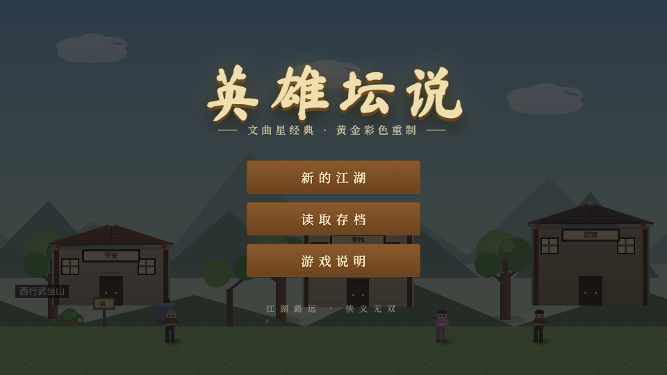
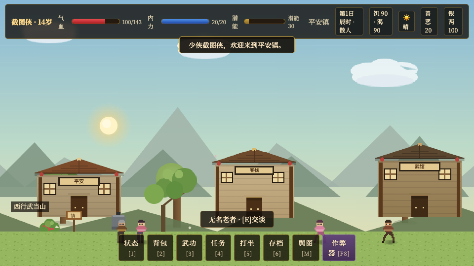
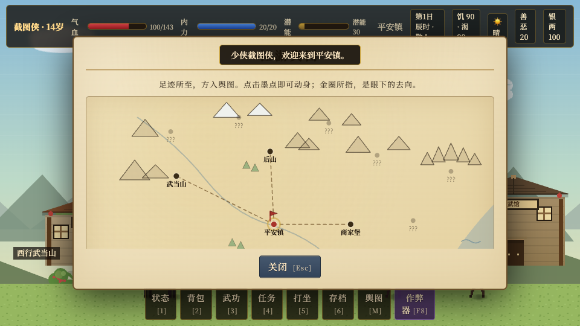
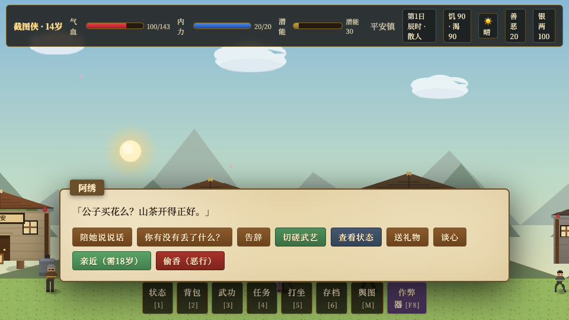
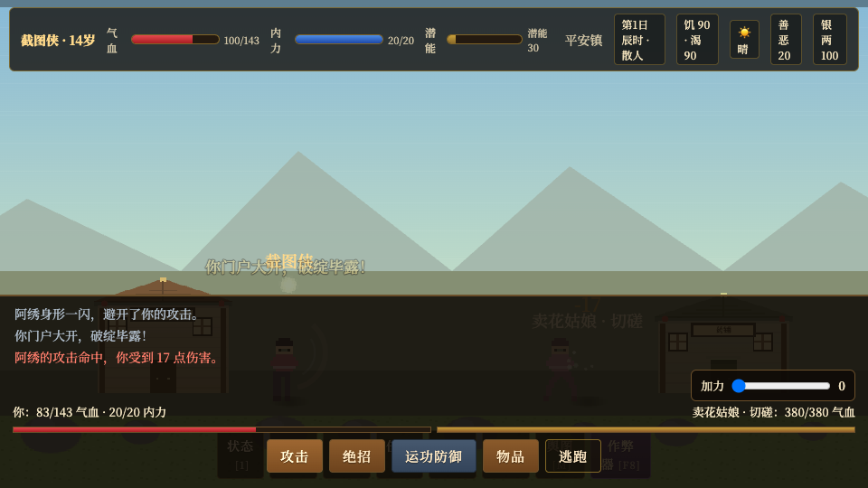
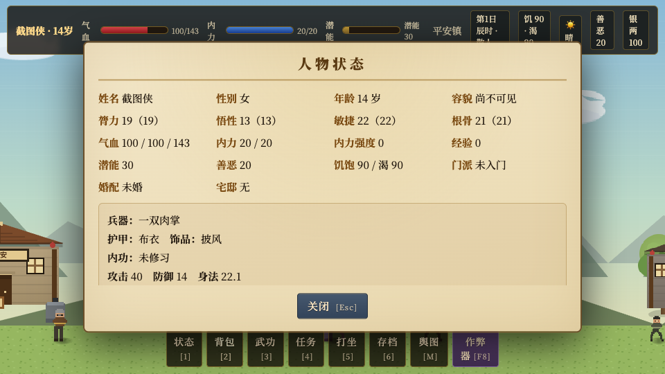

# 英雄坛说 · 黄金重制

> 文曲星经典《英雄坛说》的浏览器彩色重制版。横版武侠 RPG，包含探索、回合制战斗、门派拜师、开放世界生活模拟与随机江湖。

## 项目简介

本作采用 Phaser 3 Canvas 2D + TypeScript + Vite 开发。全部美术由代码在运行时程序化生成，零外部资源；DOM 覆盖层负责所有文字界面，呈现水墨纸卷与暗金红烛的武侠风格。

内容规模：

- 七大派：太极、八卦、雪山、花间、尹贺、红莲、丐帮
- 14 个室外区域 + 19 个室内房间
- 50 个 NPC，12 对关系网生活演出
- 三十余个敌人，含黑风寨、六掌门、三终局 BOSS
- 旧任务文案保留为世界观底料；无任务流程、无固定结局
- 昼夜、天气、随机事件、传闻、恋爱、成亲、宅邸、锻造、存物柜
- QTE 战斗、红烛良宵/偷香、情缘录与随机关系描述
- 强对比昼夜色温与动态天气罩
- 无固定任务：开放世界模拟、NPC 关系网络、动态物品与穿越者天书

## 游戏截图













## 快速开始

```bash
npm install
npm run dev          # 开发服务器 http://127.0.0.1:5173/
npm run build        # 生产构建到 dist/
npm run build:single # 单文件构建到 dist-single/index.html
npm run preview      # 预览生产构建
npm run balance      # 战斗平衡模拟
```

注意：根目录 `index.html` 是 Vite 入口，不要在 `file://` 下直接打开；可直接玩的是 `dist-single/index.html`。

## 操作

- 移动：方向键 / A D；W 进入房间
- 交互：E 或回车
- 菜单：1 状态、2 背包、3 武功、5 打坐、6 存档
- 舆图：M
- 穿越者天书：F8

## 情缘与关系

- 情缘只限异性，且双方须成年。
- 好感达到 60（已婚 40）后解锁「共度良宵」：进入 QTE 良宵战斗，胜利好感 +5、失败 -5；之后对方成为道侣，会用「相公/娘子」称呼，并可「分道扬镳」清零好感。
- 「偷香」为双方主动的一夜风流：无需好感、无道德惩罚、不改变称呼、不成为道侣；胜败各有反馈。
- 人物状态里的「情缘录」会记录共度良宵、一夜偷香、好感与次数；点击名字可查看 NPC 人物志，人物志会追加随机关系描述。

## 开放世界

- 没有任务和主线；世界由关系、随机事件、物品与环境变化推动。
- NPC 会主动找你对话、挑衅、求助或交易；NPC 之间也会随机往来，关系随时可能变好或变坏。
- 玩家与 NPC 互动时，NPC 会走到玩家面前、以头顶气泡对话，再回到原位置，与 NPC 互聊采用同一套演出。
- 每个 NPC 都有确定性分配的独门招式和随身物品，人物志中可查看。
- NPC 位置更随机：房间里的 NPC 可能外出闲逛，其他地图的 NPC 也可能串门；位置按日期/时辰确定性迁移并持续演化。
- NPC 有作息表：工作日 9-16 在固定岗位，其余时间随机外出；周末全天随机休假，跨图串门概率更高。
- NPC 之间会爆发可见的 1 对 1 战斗，战斗过程在头顶气泡中展示；场景里可以同时有多组互斗，但同一 NPC 不会同时参与两场。
- 对话、互动、战斗、世界事件统一以头顶悬浮文字展示，字号统一，叙事流同时留存最近几条。
- 玩家对话、NPC 互聊、随机事件统一进入同一套叙事视觉与展示位置。
- 对 NPC 使用「对话 / 善意 / 敌意」三种意图，结果随机；商店、学艺、疗伤、切磋、亲密都可能出现。
- NPC 互动菜单可随时查看该 NPC 的人物状态。
- 敌意不一定直接开战，多数时候是口角、讥讽或威胁；连续挑衅会累计怒气，逐步提高触发战斗的概率。
- NPC 会随机修缮、破坏、复制、挪动环境物品；花草会生长、消失、分株，家具也会改变。
- 背包里的所有物品都可以「对周围使用」：把食物、酒水、药物、材料扔向花草或家具，会产生随机变化与文字。
- NPC 互动菜单可使用背包物品：把食物、酒水、药物、书籍交给 NPC，会得到随机回应并影响关系。
- 战斗自动触发已掌握武学，QTE 影响当次发挥；战斗中看到新武学会记入穿越者天书，可瞬间掌握。
- 所有互动结果都会以打字机大字显示，并在屏幕顶部留存最近几条。
- 每个 NPC 都有一本江湖日志，社交、冲突、物品事件会同时写入相关 NPC 的日志。
- 新建角色会先看到穿越者天书的开场介绍，再进入平安镇。

### 世界逻辑

#### 状态与持久化

- 世界状态存在 `GameState.world`，存档版本 v3。
- `npcRelations`：NPC 与 NPC、NPC 与玩家的多对多关系网络，键为成对主体。
- `dynamicObjects`：环境物品（花草、灌木、石头、药草等）的运行时状态。
- `interactionLocks`：1 对 1 互动锁，主体正在互动时不能被其他主体插入。
- `objectHistory`：环境物品变化的历史文字。
- `areaVariations`：各区域的随机色调与演化标记。
- 所有世界状态随存档读写，读档后继续演化。

#### 关系网络

- 关系维度：`friendliness`（-100 敌对 ~ 100 友好）、`respect`（-100 轻视 ~ 100 敬畏）、`love`（0-100）、`trust`（0-100）。
- 玩家与 NPC 平级，玩家节点固定为 `"player"`。
- 每次对话、善意、敌意、NPC 互聊、NPC 互斗、物品互动都会以随机幅度改变双方关系。
- 关系越差，NPC 越可能对你或彼此抱有敌意；关系越好，越可能主动示好、交易或传授。

#### 1 对 1 互动锁

- NPC-NPC、NPC-玩家、NPC-物品全部使用同一套锁。
- 互动开始前同时锁定两个主体，结束、超时、死亡或离开区域后释放。
- 被锁定的 NPC/物品不会加入其他互动；玩家对忙碌 NPC 只能得到“无暇理会”类反馈。
- 场景里可以同时有多组独立互动，但每个主体只能参与一组。

#### 三意图

- `对话`：随机闲聊、传闻、商店、学艺、疗伤、锻造等情境结果。
- `善意`：送礼、帮助、亲密、传授、交易等正向结果，提升友好/信任/爱意。
- `敌意`：多数时候是口角、讥讽、威胁；连续挑衅会累计怒气并逐步提高开战概率。
- 敌意开战概率公式：基础概率（普通 NPC 8%、门派/强敌 14%）+ 累计挑衅次数 × 10% + 敌意关系加成，最高 70%；一旦真的开战，怒气清零。

#### 对话生成

- 对话由身份、称号、关系、天气、时辰、世界观碎片、当前事件等槽位组合生成。
- 文案池与槽位叉乘，同一 NPC 在不同状态、天气、关系下会得到不同对话。
- 世界观碎片来自 `content/lore.ts`，会随机埋入对话和传闻。

#### NPC 主动互动

- NPC 会随机主动找玩家：问候、闲聊、求助、交易、示好、挑衅，小概率直接开战。
- NPC 之间会随机对话，也会因关系恶劣爆发可见的 1 对 1 战斗。
- NPC 互斗过程以头顶气泡展示招式、命中、收场文案，结束后关系继续恶化。

#### 物品世界

- 环境物品拥有三个基础维度：`integrity` 完整度、`growth` 生长度、`quantity` 数量。
- NPC 会随机执行：修缮、破坏、复制、挪动、使用。
- 修缮让物品变大变亮，破坏让物品变小变暗甚至消失，复制会在附近生成同类副本。
- 物品变化会写入 `objectHistory`，并同步改变尺寸、颜色、透明度、位置和数量。
- 花草会持续生长；区域会随机出现色调变化，让同一张地图每次看起来不同。
- 玩家可以把任意背包物品投向当前区域的环境物品，结果按物品类型随机：食物留下油光、酒水浇灌、药物修复、材料堆叠，特殊物品产生荒诞变化。

#### 战斗与武学

- 玩家不选择出招：战斗从已掌握且武器适用的武学中随机触发。
- QTE 是唯一手动反应，成功会增强当次随机招式；物品和逃跑保留为紧急操作。
- 敌方使用武学时，武学名会记入 `observedSkills`。
- 穿越者天书可瞬间掌握任何所见武学到该武学上限，无视门派限制。

#### 叙事流

- 所有对话、互动结果、战斗描述、随机事件、世界变化都进入同一套打字机大字流。
- 新内容逐字显示，最近 8 条留存，旧内容淡出但不立即消失。

### 提醒

- 存档槽 0 为自动存档，1-3 为手动存档；世界状态会随存档继续演化。
- 按 M 开舆图可传送至已探索区域。
- 普通战斗死亡会银两减半、潜能损失三成；切磋与掌门挑战死亡无惩罚。
- F8 穿越者天书可调整数值、掌握所见武学、查看世界档案。

## 旧版隐藏内容（保留为世界观底料）

> 以下内容来自旧版任务与机关设计，部分仍保留在数据中，但不再构成任务流程。

### 隐藏玩法

- `YOBDC` 密码：创建角色时名字填 `YOBDC`，进入经典黑白模式，并直接获得 9999 潜能与银两。
- 散修逍遥线：不拜任何门派，集齐猛虎拳（拳经）、惊天刀法（惊天刀谱）、醉拳（焦黄纸页）后，找镇口无名老者选「请老丈过目」，获得 80 级逍遥心法、绝招「逍遥游」和称号「逍遥散人」。
- 偷香（一夜风流）：成年后对阿绣、唐晚词等女性攻略角色使用「偷香」，双方主动、不需好感，进入红烛 QTE 良宵战斗；胜败各有反馈，不会改变称呼或结成道侣，也无道德惩罚。
- 隐藏坏结局：买一根麻绳，到镇口歪脖树选择「一了百了」，触发上吊结局。
- 掌门挑战与切磋死亡无惩罚，可以反复挑战；切磋敌人按 NPC 身份四档动态生成。

### 隐藏物品

- 四本奇书：神秘人的手抄本、穷秀才用毛笔换的拳经、店小二 10 个肉包子换的惊天刀谱、马大哈支线奖励的焦黄纸页。
- 白玉萧：后山矿洞约 5% 概率挖到，送给阿绣加 40 好感并换来山茶花。
- 金钗：后山药草丛约 15% 概率采到，马大哈总说那是她丢的。
- 大还丹：旅行或投宿时遇到「神药商贩」，花 50 两有 40% 概率买到真药。
- 玄铁锻造：铁矿石或玄铁可以打造自定义命名的随机兵器，存在隐藏品质词条。
- 白玉佛：守墓老人赠予的饰品，防 +8。
- 桃花簪：阿沅临别赠予的饰品，防 +6。
- 绣帕：旧版偷香恶行线遗留物品，新版本不再通过偷香获得。

### 隐藏机关与地点

- 桃花源小筑：武当山右侧的小院，花 2000 两买下后，卧榻免费全恢复，还有存物柜可存放物品。
- 歪脖树：配合麻绳触发上吊结局的机关。
- 石窟裂缝：基本轻功 30 级才能查探，文案暗示云中鹤老巢，但目前没有更深内容，属于预留彩蛋。
- 镇口老井：小乞丐说井底藏了东西，但实际只能喝水，是一条尚未实装的传闻线索。
- 时空尽头铜镜：集齐六块石板后在这里选择最终 BOSS，三个 BOSS 对应三个结局。
- 夜间限定敌人：夜行鬼和云中鹤只在 21 点到凌晨 5 点的后山出现。

## 天气与昼夜

- 全天色温关键帧明显：黎明橙粉、清晨淡金、正午清冷青蓝、黄昏金红、深夜蓝紫。
- 雨天、雪天、雾天、风天各有专属颜色罩，并会按昼夜浓度自动加深或变淡。

## 穿越者天书

- F8 打开，可改：四项天赋、银两、潜能、经验、善恶、内力强度、年龄、气血、内力、饥饱、口渴、中毒、容貌、日期时辰、天气、性别、门派、宅邸、好感、物品数量、单门或全部武功。
- 自动记录所见武学，可瞬间掌握到该武学上限。
- 只有已经见过的武学才能通过天书掌握；未见过、未记入天书的武功无法直接作弊。
- 支持瞬移、锁血无敌、经典黑白模式。
- 所有数值按江湖上限截断：天赋 10-60、善恶 ±100、内力强度 0-999、物品 0-999、武功按各自上限。

## 存档

- localStorage key：`yxts-golden-save`
- 存档版本 v3；v1/v2 旧档自动迁移，损坏存档自动隔离备份

## 目录结构

```text
src/game/content  纯数据与文案
src/game/sim      模拟层规则与状态
src/game/scenes   Phaser 场景
src/game/view     程序化美术与昼夜
src/ui            DOM 界面
scripts           平衡模拟与 QA 脚本
```
