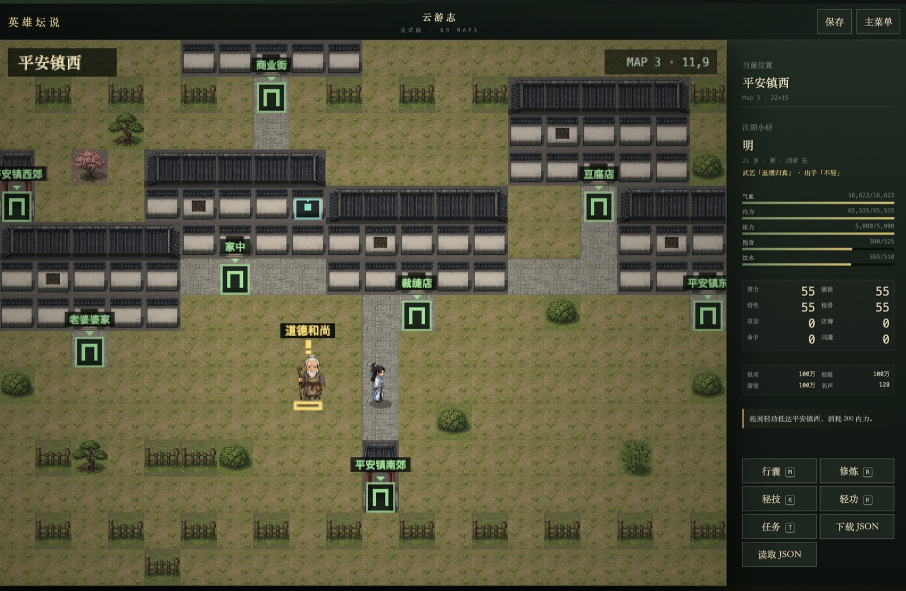
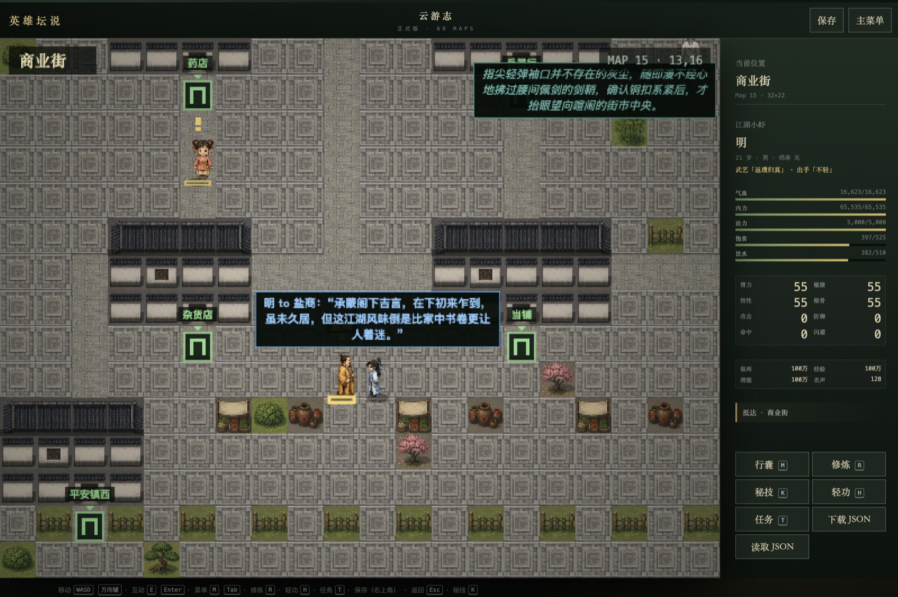
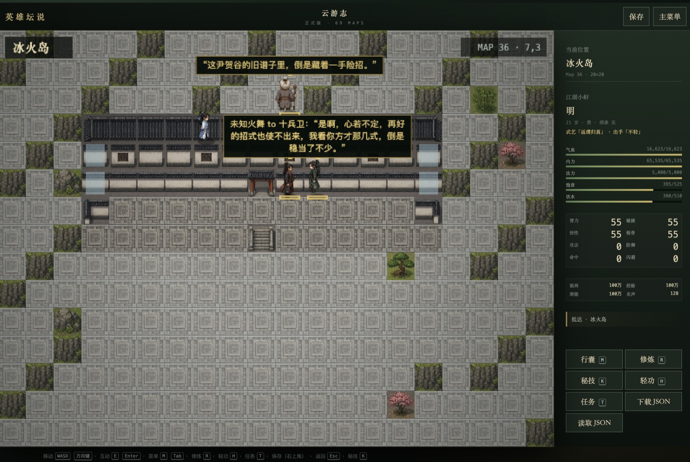
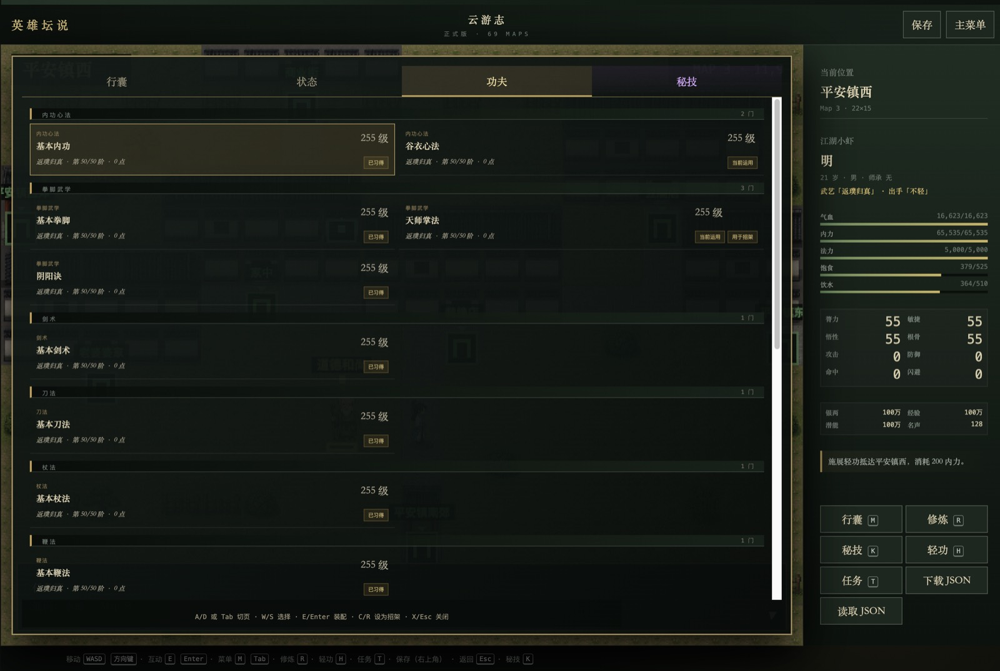
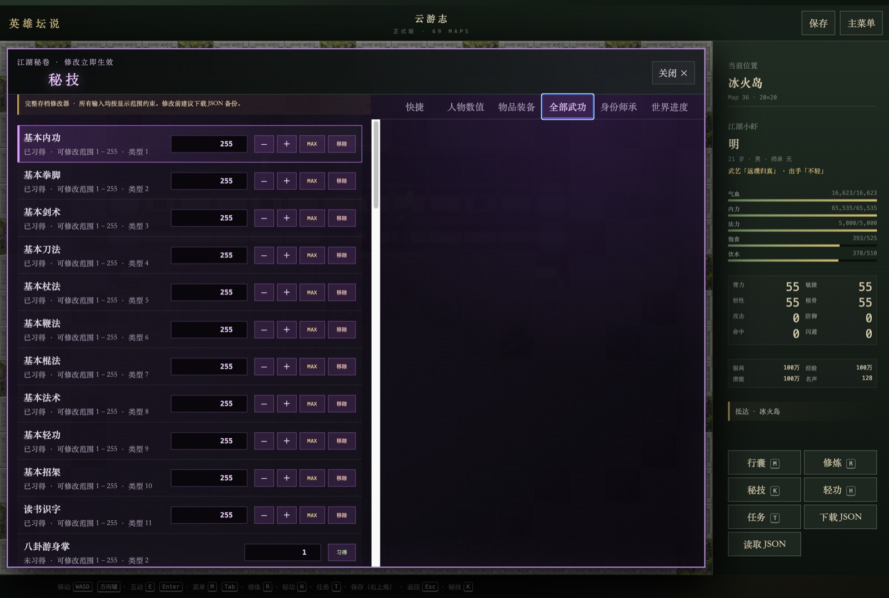

# Hero Altar Remake · 英雄坛说：云游志

一个以经典武侠 RPG 规则为基础、面向现代浏览器重制的单机 Web 游戏。

这个项目不只想复刻旧游戏界面，而是尝试打造一个会自行运转、让玩家感觉“人物真的生活在这里”的武侠世界：原作任务、武功、战斗、门派与数值系统构成稳定的游戏规则；本地大语言模型负责 NPC 的即时对话、自言自语和环境动作，让世界在玩家探索时持续发生小型演绎。

> 当前版本已经具备完整地图探索、原作任务与战斗、人物成长、本地存档、NPC动态活动及本地LLM环境对话。NPC长期记忆、自主目标和长期规划仍在未来路线图中。

> 本项目的原作规则、数据库结构与部分移植代码参考并改编自 [qq634488405/RMXP-Hero](https://github.com/qq634488405/RMXP-Hero)。感谢原作者及历代《英雄坛说》社区开发者公开整理 RMXP 工程与脚本，使这次浏览器重制成为可能。

## 实机画面


### 69张地图与城镇探索



网页版本保留原作69张地图及转场关系，同时重新组织道路、院落、围栏、植被和多格建筑。绿色门牌是可进入地点，玩家可以在平安镇、商业街、各大门派、洞府与险地之间探索；地图事件继续负责交易、任务、拜师、战斗和场景转移。



商业街把药店、杂货店、当铺和其他可互动建筑连成街区。玩家靠近NPC并停下后会进入地图即时会话，蓝色气泡代表主角；未参与谈话的同屏NPC仍可独立行动或自言自语。

### 门派与地域场景



少林、武当、峨眉、丐帮、雪山、红莲、玉女峰和冰火岛等区域拥有不同的地面、建筑、景观与门派人物风格。NPC会受自己的年龄、性别、身份、门派、外貌和武境约束，并只与近身人物展开定向对话。

### 活着的地图：NPC群聊、自言自语与动作


同屏NPC会随机活动、走近彼此并在3×3听觉圈内按顺序定向交流；未近身时可以自言自语或进行动作演绎。


### 玩家近身加入地图会话


玩家停在NPC身边时可以成为对话参与者；玩家移动后立即退出环境会话。蓝色气泡突出主角，最新气泡位于最上层。

### 独立自由对话与自动推进


自由对话保留独立历史，上半部为实时记录，底部为行动和语言输入；可以手动交流，也可以让主角与NPC依据各自设定自动推进。

### 战斗与本地模型武侠叙事


战斗系统包含切磋、生死战与剧情战，支持普通攻击、武器匹配、招架、主动绝招、法术链、冷却、战斗物品、逃跑、战利品和道德/任务结算；战斗双方使用统一人物立绘，战斗过程保留完整事实记录并可由本地模型生成精简武侠叙事。NPC数值按战斗等级在原始数据中公平重平衡，以满级玩家为天花板（玩家保持最强），顶级高手血量/内力与玩家相称但略低；高手还能从自身武功中选择可支付的攻击型绝招；没有武功的百姓保持原始弱小数值。

### 武功体系与招架配置



功夫界面按内功、拳脚、剑法、刀法、杖法、鞭法、轻功、招架和知识类武学分类展示。每门武功保留原作等级与50阶境界评价，并可配置当前运用、攻击与招架关系；修炼、请教、秘籍、潜能和师承共同决定成长。

### 开发与测试用秘技面板



内置秘技面板用于开发、回归测试和自由体验，可以调整人物数值、物品装备、全部武功、身份师承与世界进度。修改会立即进入同一份正式存档结构并显示合法范围：先天四维上限30，经验上限1000万，加力与法点服从当前内功/法术等级；“全参数MAX”保留年龄。修改器允许门派与师父独立组合，正常拜师仍执行门派限制。

## 已实现内容

- 69张原作地图与完整转场网络。
- 400个地图事件、955条事件指令和215个浏览器事件适配。
- 原作NPC交谈、主线、悬赏、义工、石料、寻物、隐藏交换和坛挑战等任务。
- 60门武功、40项主动绝招，以及打坐、冥思、吸气、疗伤、加力、法点和练功。
- 33种物品、32种武器、34种防具、装备派生属性、自制武器与重铸。
- 切磋、生死战、剧情战、掉落、道德、击杀记录和任务结算。
- NPC数值按等级公平重平衡、高手命中成长与主动绝招，以及高资源递减收益的法术和持续燃烧公式。
- 饥饿、饮水、恢复、游戏时间、年龄、钓鱼、小游戏、铸剑、家园和家具。
- 浏览器本地存档及JSON导入/导出。
- 原创像素人物、门派服装、人物立绘、建筑、地形和室内家具。
- NPC在当前屏幕真实可见格子内随机行走、面对面靠近和恢复活动；地图瓦片仅作视觉画布，墙体、屋顶、家具和地形均可穿行。
- 地图先铺连续的草地、木地板、石材、水面和道路基底，再以低密度叠加透明背景的植被、家具与功能道具，避免地面和杂物混成重复贴片。
- NPC自言自语、动作、一对一会话、定向群聊和玩家近身自动参与。
- 对话参与者使用统一事实档案：年龄、性别、门派、师承、外貌、武境阶梯和兵刃均作为不可改写信息提供给模型。
- 统一LLM队列：玩家对话优先，其次为NPC近身对话、自言自语和动作。
- 严格3×3近身听觉圈：玩家和NPC只有近身才能对话，同屏但未近身只能独演。
- 气泡按照出现时间分层，最新内容显示在最上层；台词与动作使用不同颜色。所有气泡自动错开布局（头顶堆叠/移下方/左右平移），玩家气泡始终最上层；自言自语标「XXX自言自语：」，动作标「XXX正在和环境交互：」。
- 独立的自由对话界面，支持玩家输入行动/语言和自动轮流对话。

更完整的产品现状与每个系统的规则见：

- [当前游戏设计与完成度](docs/CURRENT_GAME_DESIGN.md)
- [技术架构与LLM接入](docs/ARCHITECTURE.md)
- [后续路线图](docs/ROADMAP.md)
- [移植审计](docs/PORT_AUDIT.md)
- [严格一致性审计](docs/STRICT_PARITY_AUDIT.md)
- [美术资源与署名](ART_CREDITS.md)

地图先绘制连续的纯净材质基底：室内为木地板，室外按场景使用石材、草地、
水面、雪地或路面；植被和家具随后以透明且严格对齐整数网格的独立物件叠加，
避免基底夹带杂物或家具被跨格切成两半。

## NPC世界模拟

当前NPC运行时只模拟玩家当前地图和实际出现在640×480画布中的20×15格区域，以控制本地模型和浏览器资源消耗。

- NPC在屏幕内全地图格子随机活动；原RMXP通行标记不参与移动，只保留地图边界与人物占位。
- NPC可从较远处发现其他NPC并走近，但只有进入彼此周围一圈格子后才能对话。
- 玩家进入同样的近身范围后，NPC或玩家可自然开场；多名近身NPC会形成有顺序的定向群聊。
- 玩家移动会立即退出环境会话；NPC结束谈话后恢复活动。
- 未近身但仍在屏幕中的NPC可自言自语或进行独立动作演绎。
- 所有环境文本都由LLM生成；项目不内置默认台词、动作池或模型失败时的文本兜底。
- 即时会话只有短期上下文，不写入存档，也不会修改任务、背包或战斗状态。

## 本地LLM与LM Studio

当前默认使用[LM Studio](https://lmstudio.ai/)在玩家本机运行模型，通过它的OpenAI兼容接口生成：

- NPC自由对话；
- 玩家自动回复；
- NPC与NPC的即时对话和群聊；
- NPC自言自语和动作；
- 可选的战斗叙事。

默认代理地址为同源的`/api/lm-studio`，服务端再访问：

```text
http://127.0.0.1:1234/v1/chat/completions
```

使用方式：

1. 安装并打开LM Studio。
2. 下载一个支持中文角色扮演的指令模型。
3. 在LM Studio中加载模型并启动Local Server。
4. 确保端口为`1234`，然后启动本项目。

本地模型不是硬编码依赖。所有模型请求集中在`app/game-core/lm-studio.ts`和`app/api/lm-studio/route.ts`。如果希望接入OpenAI、Anthropic、Gemini、Ollama或其他LLM API，可以替换服务端代理与传输层，同时保留现有提示词、队列、会话生命周期和游戏状态隔离规则。接入云端API时请自行处理密钥、费用、限流、隐私和内容政策，切勿把API密钥提交到仓库。

## 运行项目

要求Node.js `>=22.13.0`。

```bash
git clone https://github.com/WeimingLu1/Hero-Altar-Remake.git
cd Hero-Altar-Remake
npm install
npm run dev
```

打开终端显示的本地地址，正式游戏入口为`/original`。

常用命令：

```bash
npm run dev      # 本地开发
npm run lint     # ESLint检查
npm test         # 正式构建 + 全量逻辑/视觉/SSR测试
npm run build    # 生产构建
npm run start    # 启动生产构建
```

没有运行LM Studio时，原作地图、任务、战斗、成长和存档仍可使用；依赖LLM的即时演绎会静默取消，不会使用预设文本冒充模型输出。

## 操作

- 移动：`WASD`或方向键
- 互动/确认：`E`或`Enter`
- 返回：`X`或`Escape`
- 人物、背包和武功：`C`
- 修炼：`R`
- 任务：`T`
- 轻功：`H`
- 秘技：`K`
- 战斗绝招：`Q`
- 战斗物品：`I`
- 生死战逃跑：`G`

## 项目目标与未来方向

现阶段已经证明“原作确定性规则 + LLM即时演绎”可以在本地单机游戏中共同运行。下一阶段的重点不是无限增加随机台词，而是让NPC形成连续生活：

- 可控、可遗忘、可总结的NPC长期记忆；
- NPC个人目标、日程、关系与地点规划；
- 记忆对称性、谣言传播和关系变化；
- 行为规划器与游戏规则验证层，避免LLM直接篡改状态；
- 更通用的LLM Provider接口和配置界面；
- 对本地模型速度、上下文与多人场景的性能评测；
- 更多原创地图模块、角色动作帧、战斗特效和音乐音效；
- 自动化端到端游玩测试和更多平台部署方式。

详细优先级、风险和验收标准见[ROADMAP](docs/ROADMAP.md)。

## 设计原则

1. 原作任务和数值结算由确定性代码负责，LLM不能直接改变正式状态。
2. 对话必须近身；屏幕范围决定哪些NPC被模拟，听觉圈决定谁能交谈。
3. 玩家相关生成永远优先，并为玩家保留本地模型资源。
4. 模型不可用时静默失败，不伪造默认输出。
5. 环境会话短暂、可取消、不持久化；未来记忆系统必须可审计和可控。
6. 原创美术不覆盖关键事件与入口；地图瓦片碰撞按产品设计永久关闭。

## 来源与致敬

本项目不是从零开始的独立规则实现。网页移植所依据的地图数据、人物与物品数据库、事件脚本、任务流程、武功和战斗规则，主要参考并改编自 [qq634488405/RMXP-Hero](https://github.com/qq634488405/RMXP-Hero)。该上游项目使用 RPG Maker XP 复刻《英雄坛说》，以白金版机制为基础并融合黄金版内容，为本项目提供了重要的代码与资料基础。

在此特别感谢 `RMXP-Hero` 的维护者 **qq634488405**，也向其 README 中致谢的 **Lee、Anliux、白丶戰廷羿、绝爱仙剑ㄝ宝宝**，以及长期整理、研究和延续《英雄坛说》的所有社区作者与玩家致敬。没有这些前人的开源工作与资料积累，就不会有现在的 Web 重制版本。

上游仓库标注采用 [GNU General Public License v3.0](https://github.com/qq634488405/RMXP-Hero/blob/master/LICENSE)。使用、修改或再分发源自上游的代码时，请同时查阅并遵守其许可证及署名要求。本项目新增的浏览器运行时、LLM 世界模拟、界面与原创生成美术，应与上游来源和原作权利分别理解；相关美术来源记录见 [ART_CREDITS.md](ART_CREDITS.md)。

## 当前状态

当前版本通过174项逻辑/视觉测试和3项服务端渲染测试，共177项，0失败。项目仍在积极开发中，接口、存档结构和美术资源可能继续调整。
